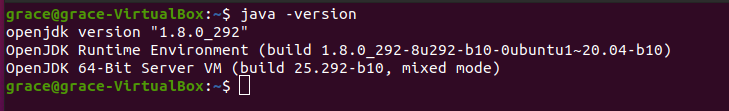
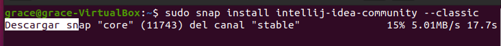
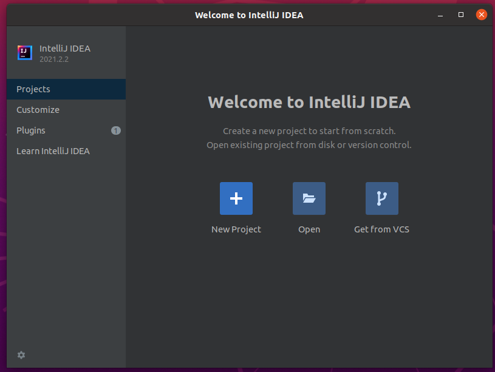

<div align="justify">

# Installation of Intellij IDEA on Ubuntu

<div align="center">
  
 </div>  
 
Intellij IDEA is an open source IDE for developing Java applications. According to surveys, Java developers prefer Intellij over other IDEs like Eclipse.

## Installation

To start with the installation of Intellij through the terminal we must verify that we have Java installed. We will do this by typing the following in the terminal:
```
java –version
```

<div align="center">
  
</div>  

Once verified that we have Java installed. We will use the Snap packages for the installation, they are packages that make the installation process smooth and without errors.
```
sudo snap install intellij-idea-community --classic
```

<div align="center">
  
</div>  

This will take a couple of minutes and at the end it will be installed.

## Execution

To start Intellij IDEA in Ubuntu we will look for it in the “Activities” search engine with the word “intellij”, or simply when we start to write the word we will see the application icon and we will click on it.

<div align="center">
  
</div>  
 
While it is loading we will see an image equal to or similar to the following, this may change depending on the version.
<div align="center">
  
</div>  

Once it is loaded, the first time we start it we will have to accept the terms and click on **continue**.

<div align="center">
  
</div>  

Once this is done it is ready to be used. We will see something similar or equal to this, although as we have said before it will depend on the version.

<div align="center">
  
</div>  

</div>  
