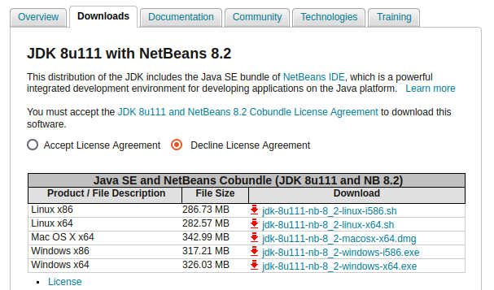
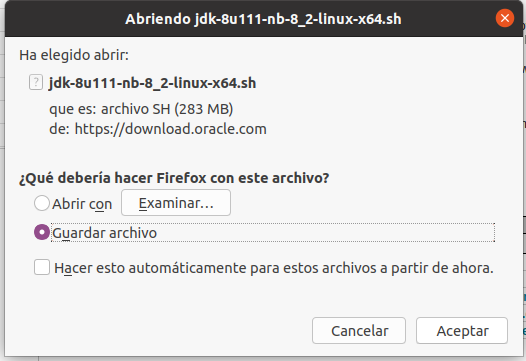
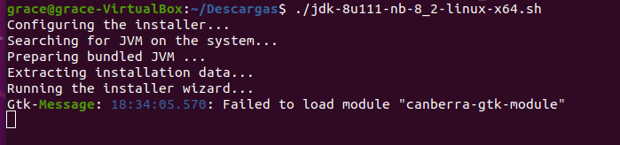
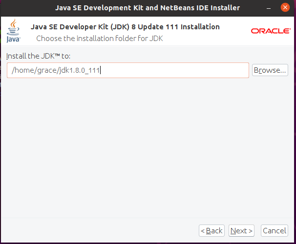
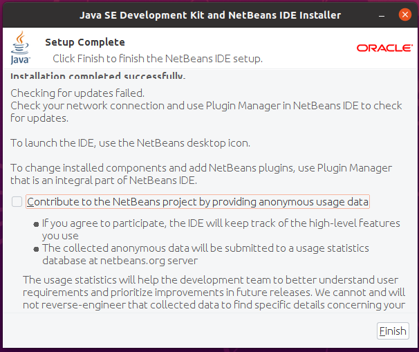
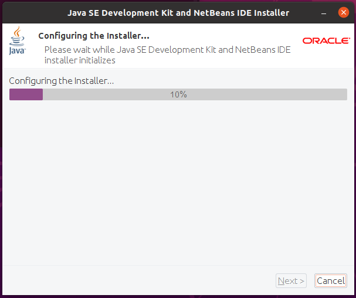
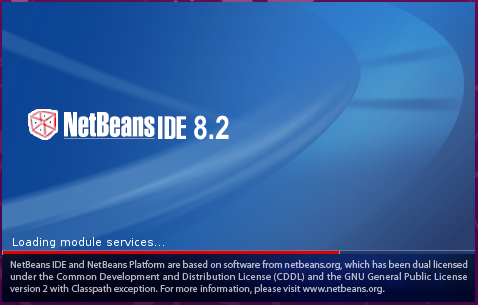
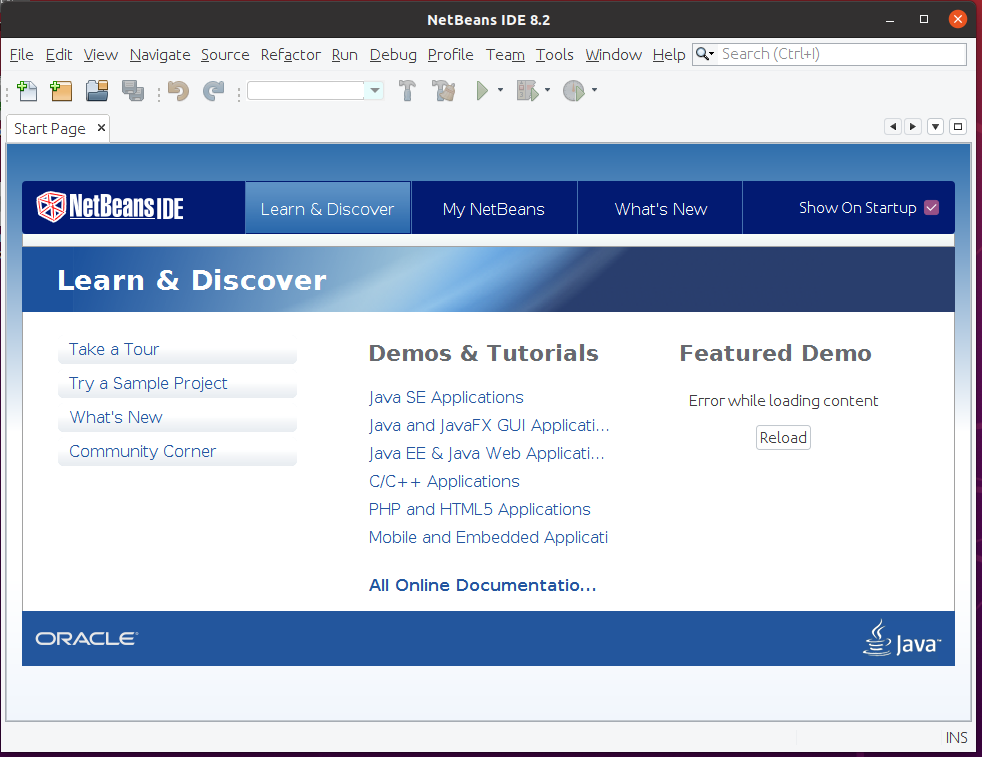

<div align="justify">

# Instalación de NetBeans 8 en Ubuntu

<div align="center">
  
 </div>  
 
Netbeans al igual que Visual Studio Code también es un IDE multiplataforma. Es muy popular para trabajar con aplicaciones como Java.

## Instalación  

Para comenzar con la instalación de NetBeans 8 a través de la terminal debemos comprobar que tenemos Java instalado. Esto lo haremos escribiendo lo siguiente en la terminal:
```
java –version
```

<div align="center">
  
 </div>  

Una vez comprobado que tenemos Java instalado. Debemos ir al siguiente 
[enlace](https://www.oracle.com/technetwork/java/javase/downloads/jdk-netbeans-jsp-3413139-esa.html) y llegaremos a una página similar a la siguiente:

<div align="center">
  
 </div>  
 
Una vez aquí debemos clicar en los **Accept License Agreement** y nos saldrá un mensaje como el siguiente:

<div align="center">
  
 </div>  

A continuación clicaremos en la versión que queremos descargar, en nuestro caso la ***jdk-8u111-nb-8_2-linux-x64.sh***  

Nos aparecerá un mensaje de descarga como el que veremos a continuación y le daremos a guardar en la carpeta que queramos.

<div align="center">
  
 </div>  

Una vez llegados a este punto iremos a la terminal y nos dirigiremos a la carpeta donde lo hayamos descargado, en nuestro caso **Descargas**.

<div align="center">
  
 </div>  
 

Situados en esta carpeta ejecutaremos el siguiente comando:

```
chod +x jdk-8u111-nb-8_2-linux-x64.sh
```

<div align="center">
  
 </div>  
 
Acto seguido ejecutamos este otro comando para comenzar con la instalación

```
./jdk-8u111-nb-8_2-linux-x64.sh
```

<div align="center">
  
 </div> 
 
Una vez hecho esto nos aparecerá lo siguiente:

<div align="center">
  
 </div>
 
Y a su vez se nos abrirá una ventana como la siguiente y le daremos a **next** .

<div align="center">
  
 </div>
 
Elegiremos la carpeta donde queramos que se nos instale y le daremos a **next**.

<div align="center">
  
 </div>
 
Nuevamente volvemos a elegir la carpeta donde queremos que se descargue y le daremos a **next**.

<div align="center">
  
 </div>
 
En nuestro caso como queremos que nos busque automáticamente las actualizaciones le damos **clic** a la casilla y le damos a **Install**

<div align="center">
  
 </div>

A continuación le damos a **Finalizar**.

<div align="center">
  
 </div>

La instalación tardará un par de minutos. Y al finalizar ya estará instalado.

<div align="center">
  
 </div>
 
## Ejecución  

Para iniciar NetBeans 8 en Ubuntu lo buscaremos en el buscador de “Actividades” con la palabra “netbeans”, o simplemente cuando empecemos a escribir la palabra veremos el icono de la aplicación y haremos clic sobre este.

<div align="center">
  
 </div>

Mientras se está cargando veremos una imagen como la siguiente.

<div align="center">
  
 </div>
 
Finalmente estaremos en la página de inicio de NetBeans 8 y veremos algo igual a esto.

<div align="center">
  
 </div>

</div>  