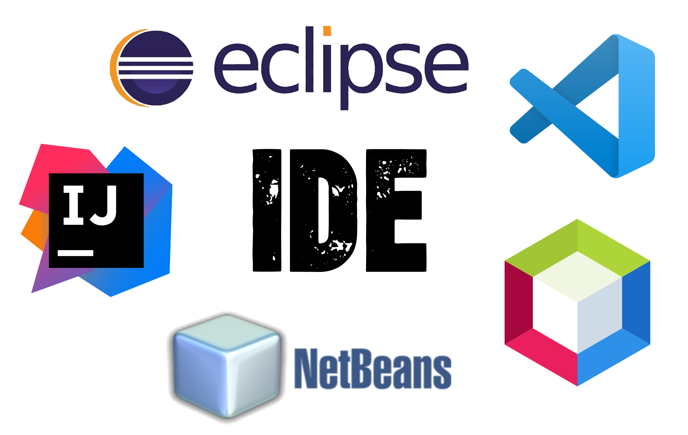

  
 

  
  
#  Instalación de diferentes IDE's en Ubuntu

# Introducción

Este repositorio está dedicado a describir la instalación de diferentes IDE's. Cuando hablamos de IDE nos referimos a **Entorno de Desarrollo Integrado** es una herramienta de desarrollo de software utilizado como editor y generador de código fuente, también podremos probar y depurar un programa.
En los siguentes enlaces se detallará la instalación de los respectivos IDE en Ubuntu a través de la terminal

- [Instalación de NetBeans 8.](installation/ES-Netbeans-8.md)    
- [Instalación de NetBeans 12.](installation/ES-Netbeans-12.md)
- [Instalación de Eclipse.](installation/ES-Eclipse.md)
- [Instalación de Intelij.](installation/ES-Intelij.md)
- [Instalación de VS-Code.](installation/ES-VS-Code.md)

#  Installation of different IDE's in Ubuntu

# Introduction
This repository is dedicated to describing the installation of different IDE's. When we talk about IDE we refer to **Integrated Development Environment** is a software development tool used as an editor and source code generator, we can also test and debug a program.

The following links will detail the installation of the respective IDE in Ubuntu through the terminal

- [Install NetBeans 8.](installation/ENG-Netbeans-8.md)
- [Install NetBeans 12.](installation/ENG-Netbeans-12.md)
- [Install Eclipse.](installation/ENG-Eclipse.md)
- [Install Intelij.](installation/ENG-Intelij.md)
- [Install VS-Code.](installation/ENG-VS-Code.md)

  
