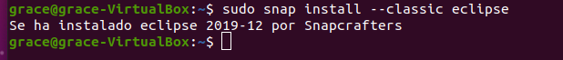
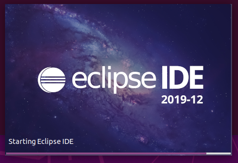

<div align="justify">
  
# Installation of Eclipse on Ubuntu

<div align="center">
  
</div>  
Eclipse is one of the most popular open source IDEs. It is usually used for Java based applications, it is also used for C/C++, PHP and Perl and other web projects.

## Installation
To start with the installation of Eclipse through the terminal we must verify that we have Java installed. We will do this by typing the following in the terminal:
```
java –version
```
<div align="center">
  
</div>  

Once verified that we have Java installed. We will use the Snap packages for the installation, they are packages that make the installation process smooth and without errors.

```
sudo snap install --classic eclipse
```

<div align="center">
  
</div>  

This will take a couple of minutes and at the end it will be installed.

<div align="center">
  
</div>  

## Execution
To start Eclipse in Ubuntu we will look for it in the “Activities” search engine with the word “eclipse”, or simply when we start to write the word we will see the application icon and we will click on it.

<div align="center">
  
</div>  

While it is loading we will see an image equal to or similar to the following, this may change depending on the version.

<div align="center">
  
</div>  

Once it is loaded we will see something similar or equal to this, although as we have said before it will depend on the version.

<div align="center">
  
</div>  

</div>  
