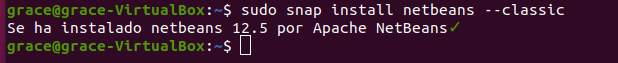
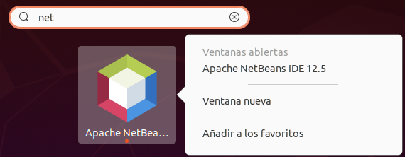
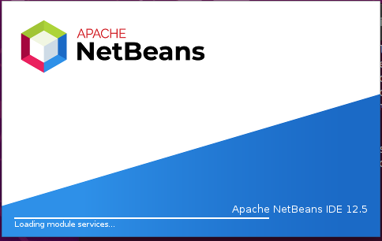
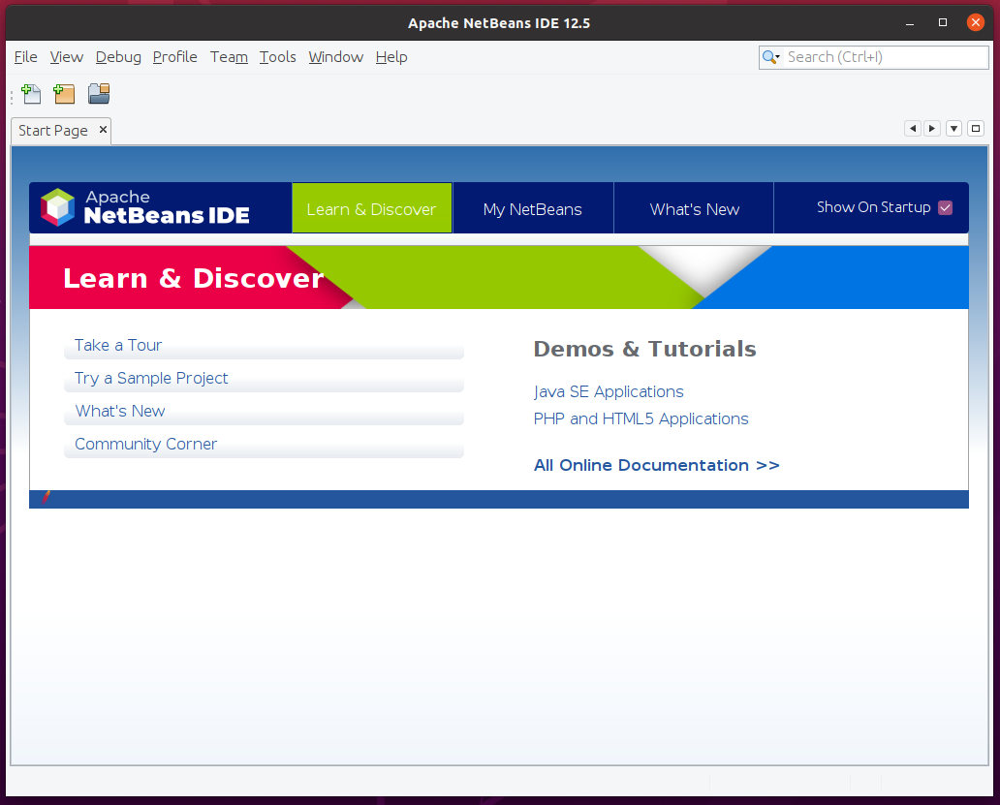

<div align="justify">

# Installation of Netbeans 12 on Ubuntu

<div align="center">
  
</div>
 
Netbeans just like Visual Studio Code is also a cross-platform IDE. It is very popular to work with applications like Java.

## Facility

To start with the installation of NetBeans 12 through the terminal we must verify that we have Java installed. We will do this by typing the following in the terminal:
```
java –version
```
<div align="center">
  
</div>
 
Once verified that we have Java installed. We will use the Snap packages for the installation, they are packages that make the installation process smooth and without errors.
```
sudo snap install netbeans --classic
```

<div align="center">
  
</div>
 
This will take a couple of minutes. And at the end it will be installed, and we will know it because it will say something similar to the following but in English:

**Se ha instalado netbeans 12.5 por Apache NetBeans✓**

## Execution

To start NetBeans 12 in Ubuntu we will look for it in the “Activities” search engine with the word “netbeans”, or simply when we start to write the word we will see the application icon and we will click on it.

<div align="center">
  
</div>
 
While it is loading we will see an image equal to or similar to the following, this may change depending on the version.

<div align="center">
  
</div>

Once this is done we will be on the home page. We will see something similar to this.

<div align="center">
  
</div>

</div>