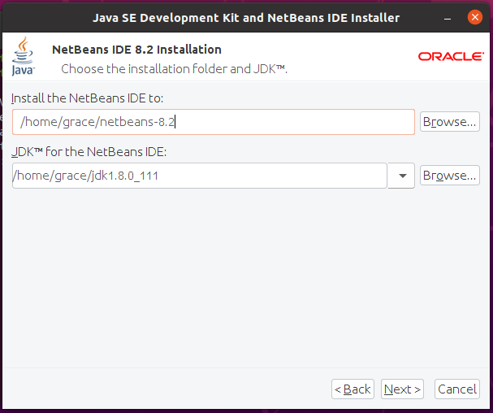

<div align="justify">

# Installation of NetBeans 8 on Ubuntu

<div align="center">
  
</div>  
 
Netbeans just like Visual Studio Code is also a cross-platform IDE. It is very popular to work with applications like Java.

## Installation

To start with the installation of NetBeans 8 through the terminal we must verify that we have Java installed. We will do this by typing the following in the terminal:
```
java –version
```

<div align="center">
  
</div>  

Once verified that we have Java installed. We must go to the next
[link](https://www.oracle.com/technetwork/java/javase/downloads/jdk-netbeans-jsp-3413139-esa.html) and we will arrive at a page similar to the following:

<div align="center">
  
</div>  
 
Once here we must click on the **Accept License Agreement** and we will get a message like the following:

<div align="center">
  
</div>  

Next we will click on the version we want to download, in our case the ***jdk-8u111-nb-8_2-linux-x64.sh***

A download message like the one we will see below will appear and we will give it to save in the folder that we want.

<div align="center">
  
</div>  

Once we have reached this point we will go to the terminal and go to the folder where we have downloaded it, in our case **Descargas**.

<div align="center">
  
</div>  

Located in this folder we will execute the following command:

```
chod +x jdk-8u111-nb-8_2-linux-x64.sh
```

<div align="center">
  
</div>  
 
Then we execute this other command to start the installation

```
./jdk-8u111-nb-8_2-linux-x64.sh
```

<div align="center">
  
</div> 
 
Once this is done, the following will appear:

<div align="center">
  
</div>
 
And at the same time a window like the following will open and we will click on **next** .

<div align="center">
  
</div>
 
We will choose the folder where we want it to be installed and click on **next**.

<div align="center">
  
</div>
 
Again we choose the folder where we want it to be downloaded and click on **next**.

<div align="center">
  
</div>
 
In our case, as we want it to automatically search for updates, we **click** the box and click on **Install**.

<div align="center">
  
</div>

Next we will select **Finish**.

<div align="center">
  
</div>

The installation will take a couple of minutes. And at the end it will be installed.

<div align="center">
  
</div>
 
## Execution

To start NetBeans 8 in Ubuntu we will look for it in the “Activities” search engine with the word “netbeans”, or simply when we start to write the word we will see the application icon and we will click on it.

<div align="center">
  
</div>

While it is loading we will see an image like the following.

<div align="center">
  
</div>
 
Finally we will be on the NetBeans 8 home page and we will see something like this.

<div align="center">
  
</div>

</div>
