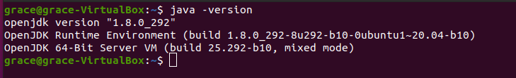
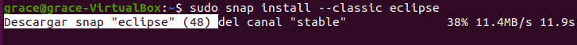
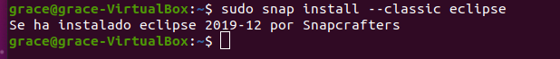
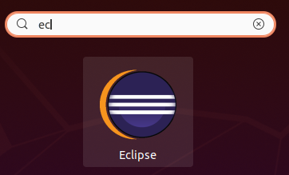
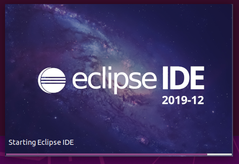
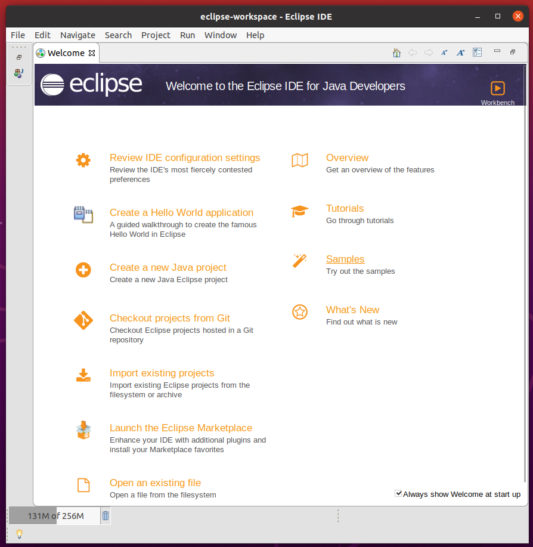

<div align="justify">

# Instalación de Eclipse en Ubuntu

<div align="center">
  
</div>  
Eclipse es uno de los IDE de código abierto más populares. Suele usarse para aplicaciones basadas en Java, también se usa para C / C ++, PHP y Perl y otros proyectos web.

## Instalación
Para comenzar con la instalación de Eclipse a través de la terminal debemos comprobar que tenemos Java instalado. Esto lo haremos escribiendo lo siguiente en la terminal:
```
java –version
```
<div align="center">
  
</div>  

Una vez comprobado que tenemos Java instalado. Utilizaremos los paquetes Snap para la instalación, son paquetes que hacen que el proceso de instalación sea fluido y sin errores.

```
sudo snap install --classic eclipse
```

<div align="center">
  
</div>  

Esto tardará un par de minutos y al finalizar ya estará instalado.

<div align="center">
  
</div>  

## Ejecución
Para iniciar Eclipse en Ubuntu lo buscaremos en el buscador de “Actividades” con la palabra “eclipse”, o simplemente cuando empecemos a escribir la palabra veremos el icono de la aplicación y haremos clic sobre este.

<div align="center">
  
</div>  

Mientras se está cargando veremos una imagen igual o similar a la siguiente, esto podrá cambiar dependiendo de la versión.

<div align="center">
  
</div>  

Una vez esté cargado veremos algo similar o igual a esto, aunque como ya hemos dicho antes dependerá de la versión

<div align="center">
  
</div>  

</div>  