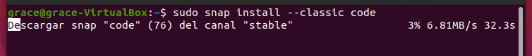
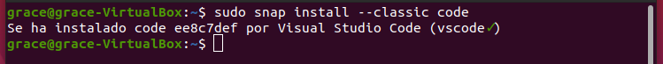
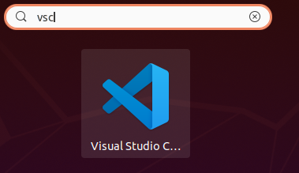
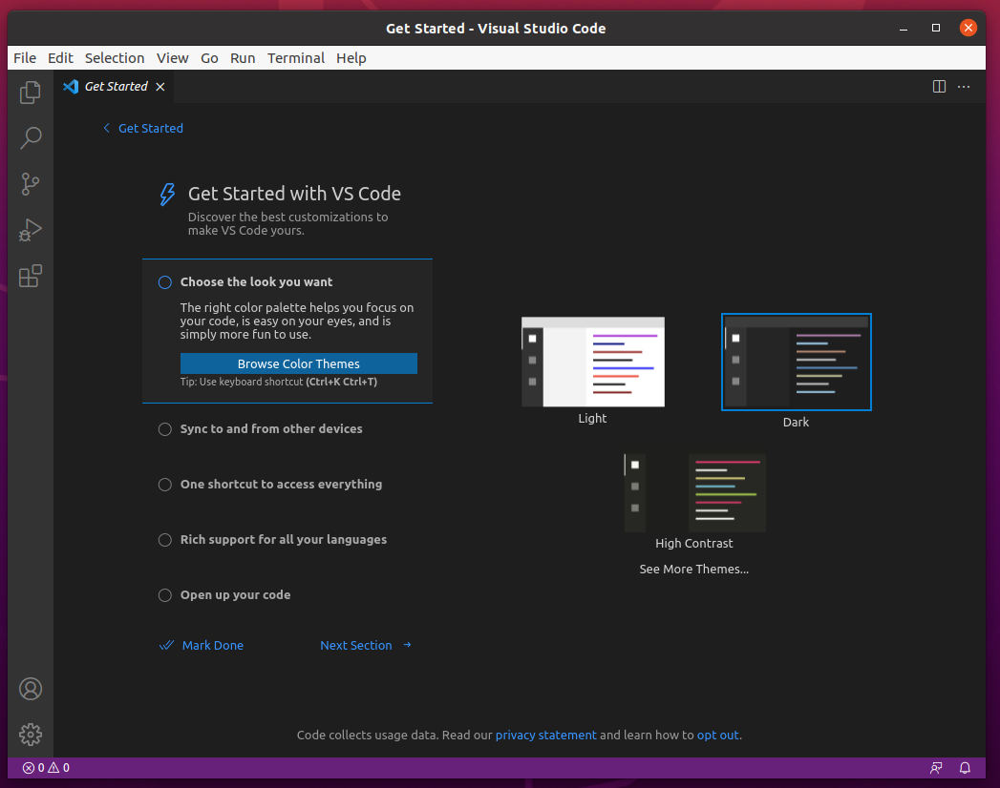

<div align="justify">

# Instalación de Visual Studio Code en Ubuntu

<div align="center">
  
</div>  

Visual Studio Code es in IDE multiplataforma. Al igual que Eclipse también está pensado para poder trabajar con aplicaciones como Java, C / C++,PHP, CSS, entre otras.

## Instalación

Para comenzar con la instalación de Visual Studio Code a través de la terminal debemos comprobar que tenemos Java instalado. Esto lo haremos escribiendo lo siguiente en la terminal:
```
java –version
```

<div align="center">
  
</div> 

Una vez comprobado que tenemos Java instalado. Utilizaremos los paquetes Snap para la instalación, son paquetes que hacen que el proceso de instalación sea fluido y sin errores.
```
sudo snap install --classic code
```

<div align="center">
  
</div> 

Esto tardará un par de minutos y al finalizar ya estará instalado.

<div align="center">
  
</div> 

## Ejecución

Para iniciar Visual Studio Code en Ubuntu lo buscaremos en el buscador de “Actividades” con la palabra “vsc”, o simplemente cuando empecemos a escribir la palabra veremos el icono de la aplicación y haremos clic sobre este.

<div align="center">
  
</div> 

Una vez hecho esto ya está listo para ser usado y veremos algo similar o igual a esto aunque esto dependerá de la versión.

<div align="center">
  
</div> 

</div>  